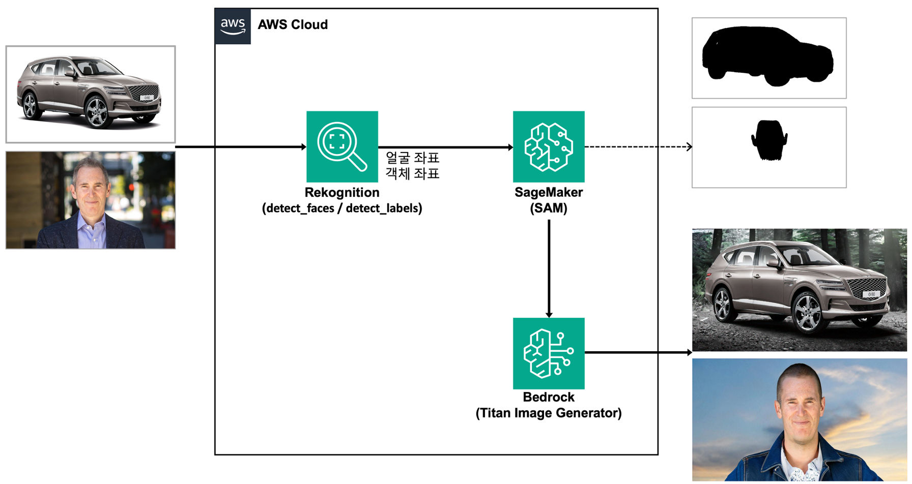
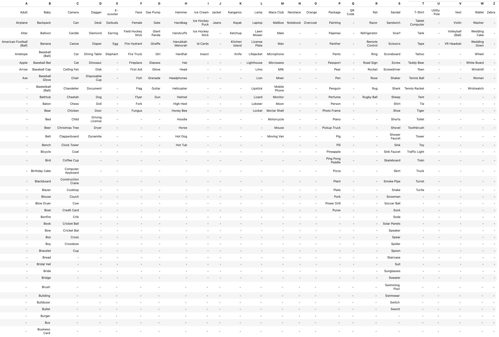

# Image Segmentation with Amazon Bedrock(Titan) and Amazon Rekognition

이 코드는 Amazon Bedrock의 image generation 모델을 확장해서 사용하기 위해 필요한 mask 이미지를 생성하기 위한 작업을 자동화하는 기능을 함께 제공하고 있습니다. 
일반적으로 생성하는 이미지에는 특정 이미지를 남기거나, 특정 이미지에 대해서면 변경하기를 원하는 image painting에서 mask 이미지는 필수로 활용되고 있습니다. 하지만, mask 이미지를 얻는 것은 쉽지 않기 때문에 수작업으로 포토샵을 이용하거나, 다른 방법으로 mask 이미지를 얻기 위해 많은 시도를 하고 있습니다. 
이 코드는 [Amazon Rekognition](https://aws.amazon.com/rekognition/)과 **[Meta AI Research, FAIR](https://ai.facebook.com/research/)** 에서 만들었고, Segmentation 분야에서 이미 유명한 **[Segment Anything Model (SAM)](https://github.com/facebookresearch/segment-anything)** 를 이용하여 자동으로 Segmentation을 통해 Mask 이미지를 생성하는 기술을 포함하고 있습니다. 특히, SAM 부분은 Amazon SageMaker에서 배포할 수 있도록 제공하고 있습니다.

이 github는 다음과 같은 workflow로 작업을 구성하고 있습니다.
 1. 변경을 원하는 이미지를 준비합니다.
 2. 이미지 내에 target이 되는 object에 대해 [Amazon Rekognition](https://aws.amazon.com/rekognition/)을 이용하여 bounding box를 추출합니다.
 3. 추출된 bounding box를 이용하여 SAM을 통해 해당 영역의 mask 이미지를 output으로 얻게 됩니다.
 4. 추출된 Mask 이미지를 이용하여 Amazon Bedrock에 있는 [Titan Image Generator](https://docs.aws.amazon.com/bedrock/latest/userguide/titan-image-models.html)의 outpainting으로 object는 그대로 두고 배경을 변경하는데 활용할 수 있습니다. (반대로 inpainting으로 object 만 변경하는 것도 가능)


## Architecture
<p float="center">
  
</p>

## 실행 방법
이 코드에는 `python>=3.8`과 `pytorch>=1.7` 및 `torchvision>=0.8`이 필요합니다. [여기](https://pytorch.org/get-started/locally/)의 안내에 따라 PyTorch와 TorchVision 관련 패키지를 설치하시면 됩니다. CPU 동작도 가능하지만 시간이 오래 걸리 수 있으므로 되도록 CUDA가 있는 ml.g4dn 또는 ml.g5 인스턴스를 사용할 것을 권장드립니다.


1. segment-anything을 설치합니다.
<br> 

```
pip install -r requirements.txt 또는 git+https://github.com/facebookresearch/segment-anything.git
```
<br> 
2. checkpoint를 다운로드 받습니다. 
 - 현재 위치 : ./image-segmentation-with-bedrock-rekognitions 아래에서,
<br> 

```
wget https://dl.fbaipublicfiles.com/segment_anything/sam_vit_h_4b8939.pth -P checkpoint
```
<br>  

 - 서로 다른 backbone 사이즈를 가진 3가지 버전의 모델을 사용할 수 있습니다. 
    - **`default` or `vit_h`: https://dl.fbaipublicfiles.com/segment_anything/sam_vit_h_4b8939.pth**
    - `vit_l`: https://dl.fbaipublicfiles.com/segment_anything/sam_vit_l_0b3195.pth
    - `vit_b`: https://dl.fbaipublicfiles.com/segment_anything/sam_vit_b_01ec64.pth


3. 폴더 소개

- Local : python 함수로 간단하게 local 환경에서 수행해 볼 수 있는 python 파일 제공
  - config/config.yaml 파일을 수정하여 다양한 시도를 할 수 있습니다.
    - candidate_prompts : 원하는 배경을 생성할 수 있는지 확인해 봅니다.
    - seed_range : 해당 범위 안에서 다양한 seed로 이미지를 생성해 봅니다.
    - result_path : 생성된 이미지가 저장되는 위치입니다.
    - cfgScale : prompt에 따르는 정도에 영향을 줍니다. 값이 클수록 prompt에 더욱 가깝게 배경을 생성합니다.
    - resize : 생성 이미지 크기를 작게 만드는 목적입ㄴ디ㅏ.
    - use_cuda: GPU 일 경우 True로 하시면 속도가 더욱 빨라집니다.
    - modelId : Bedrock의 Titan Image Generator 모델 id 입니다.
    - target_region : Bedrock을 사용하는 region 입니다.
    - checkpoint : SAM 모델의 checkpoint이며, 2번에서 다운 받은 모델의 위치입니다.
    
- 아래 코드를 수행하여 간단히 결과를 확인해 볼 수 있습니다.
<br> 
```python
python ./Local/segmentation_bedrock.py --config_file ./Local/config/config.yaml --target_label face --img_path ./test_images/andy_portrait_2.jpg
```

- target_label의 경우, 아무 값을 넣지 않을 경우에는 Amazon Rekognition의 detect_faces 함수가 동작하므로 얼굴에 대해 탐지하게 되며, target_label에 특정 값을 넣을 경우 detect_labels 함수에서 가져오게 됩니다. target_label에 들어가는 값은 아래 표에 한정되어 있거나, [여기](https://docs.aws.amazon.com/rekognition/latest/dg/labels.html)에 정의되어 있습니다.

<p float="center">
  
</p>

<br> 
- SageMaker
  - 1. deploy_sam_on_sagemaker.ipynb : 아키텍처와 같이 SageMaker에서 Endpoint를 테스트하는 부분과 이를 실행하여 테스트하는 코드를 활용해 볼 수 있습니다.
  - 2. load-testing.ipynb : Locust를 이용하여 stress 테스트를 통해 SageMaker의 autoscaling 등을 테스트해볼 수 있습니다.

## License

The model is licensed under the [Apache 2.0 license](LICENSE).